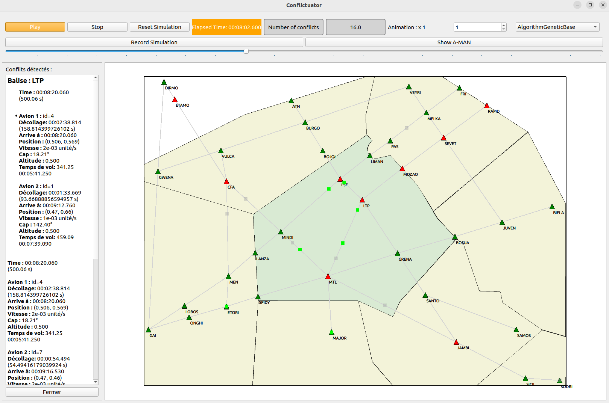

# Conflictuator
## <div align="center">Création de trajectoires conflictualisées</div>

<div align="center">
  
</div>


## Introduction
Conflictuator est un outil permettant de générer des trajectoires avec des conflits aériens.

## Fonctionnalités
- Génération de trajectoires d'avions aléatoires ou non selon ce que l'utilisateur décide
- Modélisation de conflits entre avions: 

    Deux avions sont considérés en conflits si ils partagent une ou plusieurs balises dans leur trajectoire et que leur temps de passage à celles-ci est inférieur à 60 secondes
- Visualisation des trajectoires avec une IHM
- Personnalisation des paramètres de simulation
- Paramétrisation des algorithmes d'optimisation à travers l'IHM
- Possibilités de créer autant d'algorithmes que nécessaire (voir section Création d'algorithmes)

### Prérequis
- Python 3.x
- Bibliothèques : PyQt5, numpy, ray

## Utilisation

### Exemple de lancement
```bash
python3 main.py
```

## Création d'algorithmes

Pour écrire sa propre classe d’algorithme (```AAlgorithm```), il faut:
- Ecrire la classe dans le répertoire: ```algorithm.concrete```
- La classe doit hériter de AAlgorithm ou de toute autre classe qui est elle-même une dérivation
de ```AAlgorithm```
- Le décorateur au dessus de la classe est: ```@AAlgorithm.register_algorithm```
- Implémenter la méthode run de l’interface ```IAlgorithm``` en mettant la logique de ce que l'algorithm doit renvoyer comme solution

## Création de nouveau ASimulatedAircraft

- Écrire la classe dans le répertoire : ```algorithm.nouveau_fichier.py```
• La classe doit hériter de ```ASimulatedAircraft```
• Il n’y a pas eu de mise en place de la fonctionnalité du décorateur pour cette partie.
• Implémenter les méthodes de l’interface ```ISimulatedObject```.
• Importer la classe dans ```algorithm.manager.py```
• Instancier la classe dans ```algorithm.manager.py``` à l’endroit suivant :

```AlgorithmManager.set_data``` avec ```self._data_to_algo = [MaNouvelleClasse(aircraft) for aircraft in data]```